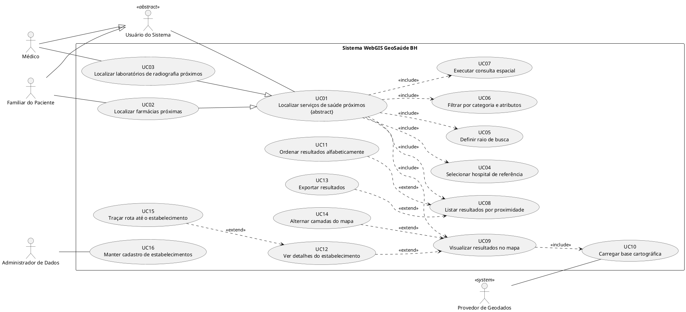
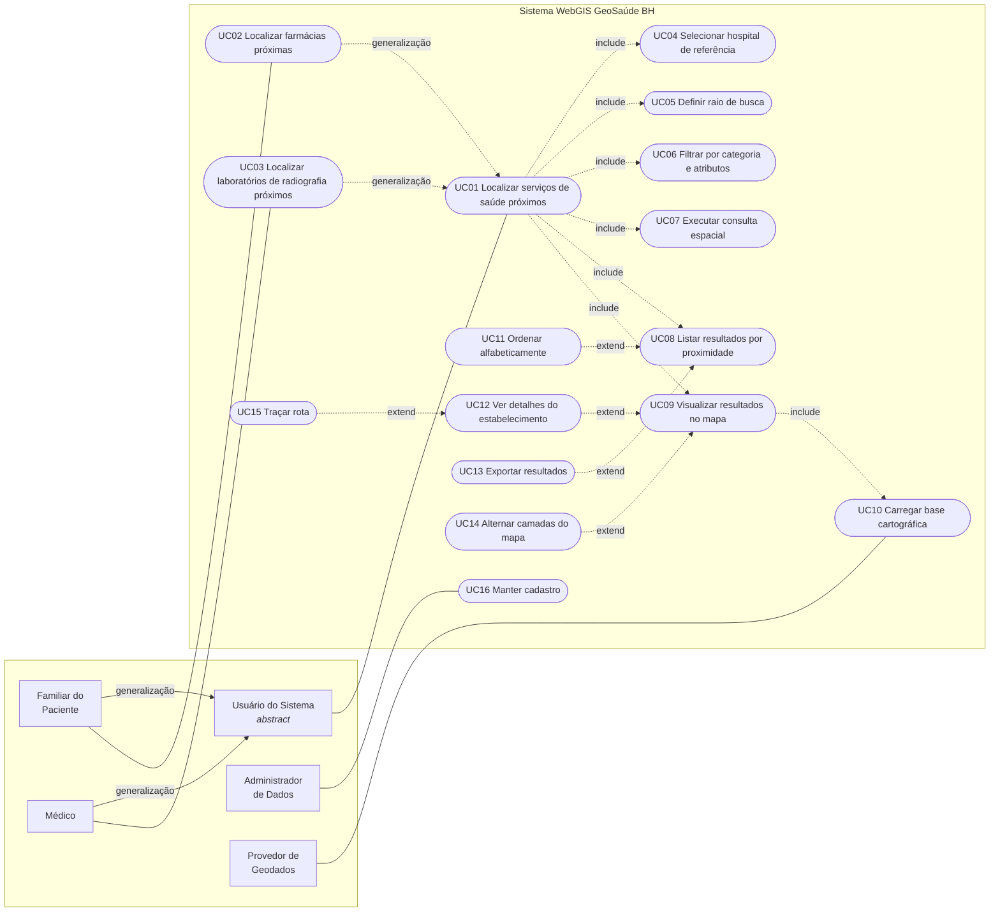

# Entregável 1 — Diagrama de Casos de Uso

**Sistema:** GeoSaúde BH — WebGIS para localização de serviços de saúde próximos a hospitais de Belo Horizonte
**Notação:** UML 2.5

---

## 1. Diagrama

O diagrama renderizado está em **[`diagrama-casos-de-uso.svg`](diagrama-casos-de-uso.svg)**
(também visível na aba *Casos de uso* do protótipo, em `../index.html`).

Abaixo, o mesmo modelo em duas formas textuais, para quem preferir regerar a figura.

### 1.1 Fonte PlantUML

### 1.2 Visão estrutural (Mermaid)

---

## 2. Atores

| Ator | Tipo | Responsabilidade no sistema |
|---|---|---|
| **Usuário do Sistema** | Primário · abstrato | Generalização de quem consulta o mapa. Concentra o comportamento comum: consultar serviços de saúde a partir de um hospital de referência. |
| **Familiar do Paciente** | Primário | Especializa *Usuário do Sistema*. Busca farmácias próximas ao hospital em que o paciente está internado (Estória 1). |
| **Médico** | Primário | Especializa *Usuário do Sistema*. Busca laboratórios que realizam radiografia para encaminhar o paciente (Estória 2). |
| **Administrador de Dados** | Primário | Mantém a base de estabelecimentos: inclusão, alteração, exclusão e validação de coordenadas. |
| **Provedor de Geodados** | Secundário · sistema | Sistema externo que fornece a base cartográfica (malha viária, limites de bairro, áreas verdes). |

---

## 3. Relacionamentos e justificativas

| Origem | Relação | Destino | Justificativa |
|---|---|---|---|
| UC02 Localizar farmácias próximas | `generalization` | UC01 | A busca de farmácias é uma variação do fluxo genérico, com a categoria fixada em *farmácia*. |
| UC03 Localizar laboratórios de radiografia próximos | `generalization` | UC01 | Mesmo fluxo genérico, com categoria *laboratório* e restrição de exame *radiografia*. |
| UC01 | `include` | UC04, UC05, UC06, UC07, UC08, UC09 | Passos obrigatórios: sem hospital, raio, filtro, consulta espacial, listagem e mapa a busca não se completa. |
| UC09 Visualizar resultados no mapa | `include` | UC10 Carregar base cartográfica | O mapa só é desenhado após a base geográfica estar disponível. |
| UC11 Ordenar resultados alfabeticamente | `extend` | UC08 | Ordenação alternativa, acionada por escolha do usuário no ponto de extensão *ordenação*. |
| UC13 Exportar resultados | `extend` | UC08 | Opcional: só ocorre se o usuário pedir CSV, cópia ou impressão. |
| UC12 Ver detalhes do estabelecimento | `extend` | UC09 | Opcional: depende de o usuário selecionar um marcador ou item da lista. |
| UC14 Alternar camadas do mapa | `extend` | UC09 | Opcional: ajuste da simbologia exibida (pontos, linhas, polígonos). |
| UC15 Traçar rota até o estabelecimento | `extend` | UC12 | Opcional a partir do detalhe: desenha a linha hospital → estabelecimento e informa a distância. |
| Familiar do Paciente, Médico | `generalization` | Usuário do Sistema | Ambos herdam as associações do ator abstrato; cada um mantém sua associação específica. |

---

## 4. Atendimento aos critérios mínimos do enunciado

| Critério | Onde aparece no diagrama |
|---|---|
| Quem busca farmácias | Ator **Familiar do Paciente** associado a **UC02** |
| Quem busca laboratórios | Ator **Médico** associado a **UC03** |
| Como o hospital é usado como referência | **UC04 Selecionar hospital de referência**, incluído por UC01 e herdado por UC02 e UC03 |
| Como filtros e raio participam da consulta | **UC05 Definir raio de busca** e **UC06 Filtrar por categoria e atributos**, ambos `include` de UC01, consumidos por **UC07 Executar consulta espacial** |
| Como os resultados são visualizados | **UC09 Visualizar resultados no mapa** (`include` de UC01) e **UC12 Ver detalhes** (`extend`) |
| Como os resultados são ordenados | **UC08 Listar resultados por proximidade** (`include`, ordem padrão) e **UC11 Ordenar alfabeticamente** (`extend`) |
| Fronteira do sistema | Retângulo *Sistema WebGIS GeoSaúde BH*; os cinco atores ficam fora dela |
| `include` e `extend` | 7 relações `include` e 5 relações `extend`, listadas na seção 3 |
| Generalização de atores | Familiar do Paciente e Médico → Usuário do Sistema |
| Generalização de casos de uso | UC02 e UC03 → UC01 |
